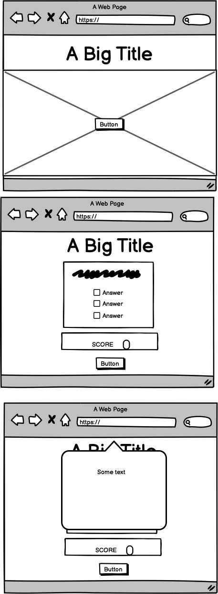
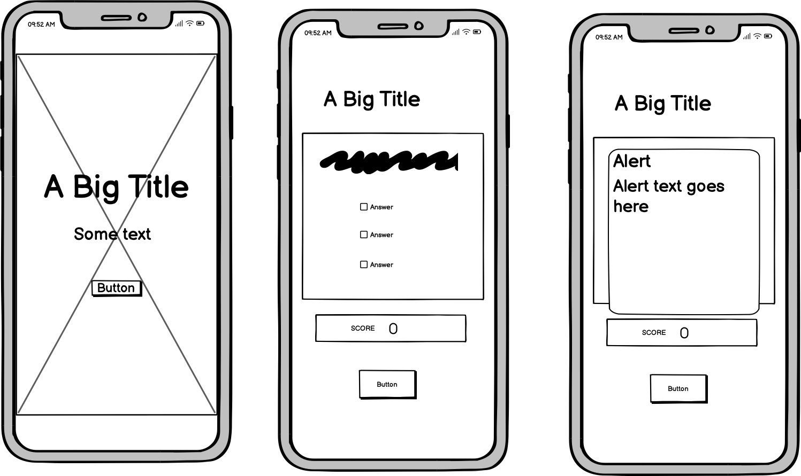

# European Capital Cities - Quiz

This is a website containing an online quiz letting the user test their skills and knowledge about European capital cities.
The site is created for the audience that wants to test their own knowledge or their loved ones, on ten different european capital cities.  

The site includes a firstpage with a clean layout and a button to start the quiz, and a quizpage where the different questions is showed with a scoreboard and a button, allowing the user to restart the quiz. 

The link to my webpage can be found here - [European Capital Cities](<https://tildeholmqvist.github.io/project-two/>).

## Site Owner Goals

- To give the user the option to easily access the quiz. 
- To provide the user with a short but fun quiz about European Capital Cities. 
- To present the user with a website that is easy to navigate, fully responsive and that contains a simple and easy layout, fitting for the websites theme. 
- To allow the user to see their results and the right answers after submitting their answers.

## User Stories

- ### First time user

  - As a first time user I want to easily access the quiz. 
  - As a first time user I want to be able to easly navigate through the different questions on the quiz. 
  - As a first time user I want to submit the quiz and get my result. 

- ### Returning User

  - As a returning user I want to easily navigate back to the firstpage to start the quiz over again. 
  - As a returning user I want to be able to to the quiz again and get a higher result.

## Wireframes

Wireframes were produced using Balsamiq.

 

 
Desktop Wireframe

 

 

    
Mobile Wireframe

 

## Features

#### Firstpage
- Start Quiz - Button
#### Quiz Page
- A quiz about European capital cities, including 10 questions
- A scoreboard
- A Restart Button

## First Page 

The first page includes an big image depicting the globe, a header with an easy layout, and a button to start the quiz. 

## Quiz Page

The quiz page has the same design and layout as the first page, but also includes 10 different slides, each with a quiz question and three suggested answers. 
Under the questionbox the user can find their scoreboard that will tell the user how many right answer they had, after completing the quiz and a alert showing telling the user to click the restart button to try again. 

# Layout & Design

My layout is simple, clean and easy to navigate through.
For a first time visitor the webpage appears structured, with pleasing colours.

#### Colours

The colorscheme for the site is in the blue spectra, beacuse it's a fitting color for the websites theme and purpose. 
The color blue is both easy for the eye, kind and aesthetically nice.

The questionbox is in black and white to make it easy to read and more accessible for the user. 
The answer is in boxes with the borders of the same blue color as the rest of the site. 

#### Images

The image that is being used on the site is an image depicting a hand-painted picture of the earth. 
It contains the same colors as the websites colourscheme. 

The image is borrowed from [Unsplash](https://unsplash.com/photos/blue-green-and-yellow-abstract-painting-znhEe1cbbQE).

#### Fonts

On this website I am using the Roboto Condensed font for all texts, with a backup of sans serif. 

The fonts is borrowed from [Google Fonts](https://fonts.google.com/).

#### Fav Icon

The favicon for this website is the earth, with europe visible. 

The favicon is borrowed from [Fav Icon](https://favicon.io/emoji-favicons/globe-showing-europe-africa).

# Technologies 

The technologies that is beeing used on this project is:
- HTML 5
- CSS
- JavaScript

# Testing

## W3C Validator HTML

KOLLA OM DU KA FIAX DEN DU HAR 

[W3C Validator](https://validator.w3.org/)

## W3C Validator CSS

No errors where found in my css.

[W3C Validator CSS](https://jigsaw.w3.org/css-validator/)

## JS Hint 
Metrics
There are 10 functions in this file.

Function with the largest signature take 2 arguments, while the median is 0.5.

Largest function has 14 statements in it, while the median is 3.5.

The most complex function has a cyclomatic complexity value of 4 while the median is 1.

## Lighthouse

When the website was 

## Broswer Testing

The webpage has been tested on different broswers such as Google Chrome, Safari and Firefox and is working correctly.

## Device Testing

The webpage has been tested on different devices such as Iphone, Ipad, MacBook Pro and iMac, and is working correctly.

## Responsiveness

The webpage responsiveness has been tested through the Google Chrom Dev Tool, [Am I Responsive?](https://ui.dev/amiresponsive) and [Responsinator](http://www.responsinator.com/) and is working correctly.

## Quiz Testing

## Testing of the alert

# Bugs and Issues

# Unfixed Bugs

# Deployment

The website was deployed through the hosting platform GitHub. 
How to deploy through GitHub: 
- Go to GitHub.com .
- Select the repository.
- Once your in the repository, select settings at the top of the page to the right. 
- In the menu to your left, go into "pages". 
- Under "Branch" use the dropdown menu and select "main" and "/root", and save. 
- When it's saved you will get the link to your active website. 

Here you can mind the active link for [European Capital Cities](<https://tildeholmqvist.github.io/project-two/>).

# Credits 